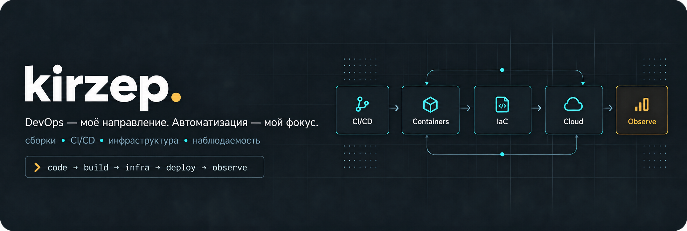

Мне интересно всё, что происходит между кодом и работающим приложением: 
**сборки, автоматизация, инфраструктура и понятные релизы.**

Развиваюсь в DevOps через практику: от CI и выпуска приложения 
к контейнерам, инфраструктуре как коду и наблюдаемости.

## Практика на реальном проекте

### [RebellioCap](https://github.com/kirzep/RebellioCap)

Приложение для Windows: запись игрового процесса, мгновенные повторы и встроенный видеоредактор. Его стек — **C++20, Rust / Tauri и React / TypeScript**.

Для меня это ещё и практическая площадка для работы со сборками и доставкой ПО:

| Область | Что есть в проекте |
| :--- | :--- |
| **CI** | GitHub Actions: проверки интерфейса, браузерные тесты, тесты C++ и Rust. |
| **Сборки** | Скрипты PowerShell, CMake, закреплённые версии инструментов и зависимостей. |
| **Кэширование** | Кэши npm, Rust и нативных зависимостей vcpkg в CI. |
| **Релизы** | Сборка Windows-установщика, подписанные пакеты обновлений и проверка версии. |
| **Документация** | Архитектура, настройка окружения, инструкции по сборке и ограничения приложения. |

[CI: проверки](https://github.com/kirzep/RebellioCap/blob/main/.github/workflows/desktop-ci.yml) · [Сборка релиза](https://github.com/kirzep/RebellioCap/blob/main/.github/workflows/desktop-release.yml) · [Релизы](https://github.com/kirzep/RebellioCap/releases) · [Документация](https://github.com/kirzep/RebellioCap/tree/main/docs)

Посмотреть интерфейс RebellioCap

 

*Скриншот из документации проекта; показаны демонстрационные данные.*

## Целевой DevOps-стек

Строю траекторию развития вокруг полного цикла: **код → сборка → инфраструктура → деплой → наблюдение → восстановление**. Ниже — карта технологий, которые хочу закрепить в портфолио; текущая практика со сборками и CI показана выше.

| Направление | Технологии и навыки |
| :--- | :--- |
| **Linux и администрирование** | Ubuntu / Debian, Bash, systemd, пользователи и права, процессы, диски, журналирование. |
| **Сети и веб** | TCP/IP, DNS, HTTP/HTTPS, TLS, SSH, маршрутизация, firewall, Nginx, reverse proxy. |
| **Автоматизация** | Bash, Python, PowerShell, Git, YAML / JSON, API, идемпотентные скрипты. |
| **CI/CD** | GitHub Actions, GitLab CI, тесты, артефакты, кэши, секреты, окружения, версии и откат. |
| **Контейнеры** | Docker, Compose, multi-stage builds, registry, volumes, сети, health checks. |
| **Оркестрация и GitOps** | Kubernetes, Helm, Argo CD, Deployments, Services, probes, ресурсы, RBAC. |
| **Инфраструктура как код** | Terraform / OpenTofu, Ansible, state, модули, provisioning и управление конфигурацией. |
| **Облако** | AWS как основной учебный трек: IAM, VPC, EC2, S3, балансировщики, бюджеты и стоимость. |
| **Наблюдаемость и SRE** | Prometheus, Grafana, Loki, OpenTelemetry, метрики / логи / трейсы, SLI / SLO, алерты, разбор инцидентов. |
| **Безопасность и восстановление** | Минимальные привилегии, OIDC, управление секретами, Trivy, Gitleaks, зависимости, бэкапы и проверка восстановления. |

## Следующие проекты портфолио

Планирую собрать последовательную серию лабораторных проектов. Каждый будет содержать код, схему инфраструктуры, инструкцию запуска и описание принятых решений.

1. **Linux Service Lab** — сервис на Linux, Nginx, TLS, systemd, диагностика и восстановление из бэкапа.
2. **Container Delivery Lab** — приложение с PostgreSQL в Docker Compose, CI/CD, безопасная работа с секретами и откат релиза.
3. **Cloud Infrastructure Lab** — инфраструктура через Terraform / OpenTofu, конфигурация через Ansible, IAM и контроль затрат.
4. **GitOps & Observability Lab** — Kubernetes, Helm, Argo CD, Prometheus / Grafana, централизованные логи и сценарий сбоя.

Проекты буду добавлять по мере реализации. Мой ориентир — показать не только успешный деплой, но и **умение объяснить архитектуру, найти причину сбоя и восстановить сервис**.

## Ещё один проект

[**Water Tracker**](https://github.com/kirzep/your-water-tracker) — ранний командный проект для учёта потребления воды: персональная цель, визуализация прогресса и история. JavaScript, HTML и CSS.

---

От работающего приложения — к воспроизводимым сборкам и надёжной доставке.

